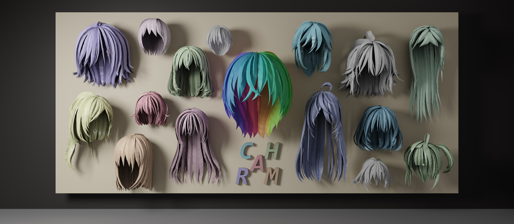

# CHARM: Control-point-based 3D Anime Hairstyle Auto-Regressive Modeling

<a href="https://hyzcluster.github.io/charm/"></a>&ensp;<a href="https://arxiv.org/abs/2509.xxxxx"></a>&ensp;<a href="https://huggingface.co/hyz317/CHARM"></a>

<div align="center">

**[Yuze He](https://hyzcluster.github.io/)<sup>1,2</sup>, [Yanning Zhou](https://amandaynzhou.github.io/)<sup>2\*</sup>, [Wang Zhao](https://thuzhaowang.github.io/)<sup>1</sup>, Jingwen Ye<sup>2</sup>, [Yushi Bai](https://bys0318.github.io/)<sup>1</sup>,**
<br>
**Kaiwen Xiao<sup>2</sup>, [Yong-Jin Liu](https://yongjinliu.github.io/)<sup>1\*</sup>, Zhongqian Sun<sup>2</sup>, Wei Yang<sup>2</sup>**

<sup>1</sup>Tsinghua University &ensp;&ensp; <sup>2</sup>Tencent AIPD 
<br>
<sup>\*</sup>Corresponding Authors   

</div>



## 🔥 Updates

**[2025/09/25]** Code, dataset, pretrained checkpoints are released!


## 🔍 Table of Contents

- [⚙️ Deployment](#deployment)
- [🖥️ Run CHARM](#run)
- [💼 AnimeHair Dataset](#dataset)
- [📝 Citation](#citation)


<a name="deployment"></a>

## ⚙️ Deployment

Set up a Python environment and install the required packages:

```bash
conda create -n charm python=3.9 -y
conda activate charm

# Install torch, torchvision based on your machine configuration
pip install torch==2.1.0 torchvision==0.16.0 --index-url https://download.pytorch.org/whl/cu118

# Install other dependencies
pip install -r requirements.txt
```

Then download data and pretrained weights:

1. **Our Model Weights**: 
   Download from our 🤗 Hugging Face repository ([download here](https://huggingface.co/hyz317/CHARM)) and place them in `./ckpt/`.

2. **Michelangelo’s Point Cloud Encoder**: 
   Download weights from [Michelangelo’s Hugging Face repo](https://huggingface.co/Maikou/Michelangelo/tree/main/checkpoints/aligned_shape_latents) and save them to `./ckpt/`.

3. **Test data**:

   Download from this [Google Drive link](https://drive.google.com/file/d/1MQXP6YCb-hvT3YsOPw2XsmmOrjWkhKvz/view?usp=sharing), then decompress the files into `./test_cases/`; or you can download from our 🤗 Hugging Face datasets library:

```python
from huggingface_hub import hf_hub_download, list_repo_files

# Get list of all files in repo
files = list_repo_files(repo_id="hyz317/CHARM", repo_type="dataset")

# Download each file
for file in files:
    file_path = hf_hub_download(
        repo_id="hyz317/CHARM",
        filename=file,
        repo_type="dataset",
        local_dir='./test_cases'
    )
```

After downloading and organizing the files, your project directory should look like this:

```
- test_cases/
    └── pc/                         # Test point cloud data
- ckpt/
    ├── charm.safetensors           # Our model checkpoint
    └── shapevae-256.ckpt           # Michelangelo ShapeVAE checkpoint
```


<a name="run"></a>

## 🖥️ Run CHARM

### Testing and Evaluation

```bash
# Autoregressive generation
python infer.py

# Sample point clouds from predictions  
python sample.py

# Calculate evaluation metrics
python eval.py
```

### Training

```bash
# Note: file_dir in configs/train.yml should be changed to your processed dataset directory.
accelerate launch --config_file acc_configs/gpu8.yaml train.py -t YOUR_JOB_NAME
```


<a name="dataset"></a>

## 💼 AnimeHair Dataset

Due to policy restrictions, we are unable to redistribute the raw 3D models of the training dataset. However, you can download the VRoid dataset by following the instructions provided in [PAniC-3D](https://github.com/ShuhongChen/panic3d-anime-reconstruction). **Please note:** When downloading the VRoid dataset, replace the `metadata.json` file mentioned in the PAniC-3D instructions with the file from [this link](https://drive.google.com/file/d/17xM1NJAN70yEfTZ2T-uBaNXrSz8v15On/view?usp=sharing). All other steps should follow the original PAniC-3D guide.

In place of the raw data, we are providing the preprocessing scripts and training data list.

First, install [Blender](https://www.blender.org/) and download the [VRM Blender Add-on](https://vrm-addon-for-blender.info/en/). Then, install the add-on using the following command:

```bash
blender --background --python blender/install_addon.py -- VRM_Addon_for_Blender-release.zip
```

Next, execute the Blender script to separate the hair meshes from the 3D models:

```bash
cd blender
python distributed_uniform.py --input_dir /PATH/TO/YOUR/VROIDDATA --save_dir /PATH/TO/YOUR/SAVEDIR --workers 32
```
*   `/PATH/TO/YOUR/VROIDDATA`: Specify the directory where you downloaded the VRoid dataset.
*   `/PATH/TO/YOUR/SAVEDIR`: Specify the directory where the separated hair models will be saved.

After separating the hair, run the following script to post-process the hairstyles and convert them into a template format:

```bash
python process_hair.py --input_dir /PATH/TO/YOUR/SAVEDIR
```
*   `/PATH/TO/YOUR/SAVEDIR`: This should be the same directory where the separated hair models were saved in the previous step.

Finally, sample point clouds from the processed hair models:

```bash
python sample_hair.py --input_dir /PATH/TO/YOUR/SAVEDIR
```
*   `/PATH/TO/YOUR/SAVEDIR`: Again, use the directory containing the post-processed hair models.


<a name="citation"></a>

## 📝 Citation

If you find our work useful, please kindly cite:

```
@article{he2025charm,
  title={CHARM: Control-point-based 3D Anime Hairstyle Auto-Regressive Modeling},
  author={He, Yuze and Zhou, Yanning and Zhao, Wang and Ye, Jingwen and Bai, Yushi and Xiao, Kaiwen and Liu, Yong-Jin and Sun, Zhongqian and Yang, Wei},
  journal={arXiv preprint arXiv:2509.xxxxx},
  year={2025}
}
```